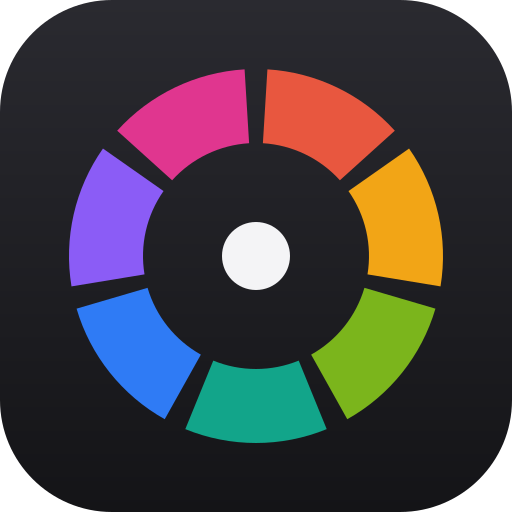

<p align="center"></p>

<h1 align="center">Septet</h1>

<p align="center">Seven creative apps in one workspace — photo editing, vector graphics, raw photo
development, page layout, PDF, video editing and motion graphics. Tabs that can be different apps,
tabs you can pull into windows of their own, and copy, paste and drag &amp; drop between the apps.</p>

<p align="center"><b><a href="https://gitlab.com/louiswalder6/septet/-/releases">Download (GitLab)</a></b>
· <a href="https://github.com/LouBoi161/septet/releases">Download (GitHub)</a></p>

| App | For | Opens |
|---|---|---|
| Photocraft | Photos, compositing, painting | PSD, PNG, JPEG, TIFF, WebP, … |
| Vectorcraft | Vector graphics, illustration | SVG, AI, EPS, PDF, … |
| Lightcraft | Raw photo library and development | DNG, CR3, NEF, ARW, … |
| Designcraft | Page layout and publishing | .designcraft, IDML |
| Pdfcraft | Read, edit, sign and organize PDFs | PDF |
| Filmcraft | Video editing | Video, audio, projects |
| Effectcraft | Motion graphics and visual effects | Projects, footage |

## Download

| System | File |
|---|---|
| Windows 10/11 (64-bit) | `Septet-…-windows-x64-setup.exe` — installs for your user, no admin rights needed |
| Windows, portable | `Septet-…-windows-x64-portable.zip` — unzip anywhere (e.g. a USB stick) and run `septet.exe`; all settings stay in the `Data` folder next to it |
| Linux (x86_64) | `Septet-…-x86_64.AppImage` — `chmod +x` and run; or `septet-…-linux-x86_64.tar.gz` with `install.sh` for a menu entry |
| macOS 11+ (Apple Silicon) | `Septet-…-macos-arm64.dmg` |
| macOS 11+ (Intel) | `Septet-…-macos-x86_64.dmg` |

The builds are not signed by Microsoft or Apple (that needs paid certificates):

- **Windows** may show "Windows protected your PC": click *More info* › *Run anyway*.
- **macOS**: drag Septet to Applications, then right-click it › *Open* the first time (or allow it in
  System Settings › Privacy & Security).

## Using it

- **Tabs**: `+` or the Septet logo (Home) opens apps. Each app runs once and keeps its own documents
  in tabs inside it. Middle-click or × closes a tab — the app asks about unsaved work.
- **Windows**: drag a tab down out of the strip and let go for a window of its own; drag it onto
  another window's tabs to move it there. Right-click a tab for *Move to Window*, *Merge All Windows*
  and *Send to*. Windows, tabs and every app's panel layout come back next time.
- **Drag content between apps**: drag a layer (Photocraft), selected art or layers (Vectorcraft),
  photos (Lightcraft), pages or objects (Designcraft), pages (Pdfcraft) or project items (Filmcraft,
  Effectcraft) onto another app's tab, wait until it opens, and drop. The source app hands over the
  best format the target takes (layered PSD, SVG, PDF, developed 16-bit TIFF, original footage …).
- **Send to**: right-click a tab › *Send to* puts that app's current document, photo, page or frame
  into another app.
- **Copy & paste between apps** goes through the system clipboard; when an app can't read what's on
  it, Septet converts it and places it like a dropped file.
- **Round trips**: Lightcraft's *Edit in External Editor* opens the photo in Photocraft, and switching
  back picks up the edit. Designcraft's *Edit Original* (Links panel) does the same for placed images.
- **Files**: drop them on a tab to open them in that app, on the tab strip to open each in the app
  made for it, or on an app to place them where you let go.
- **Shortcuts**: Ctrl+PageUp/PageDown switch tabs, Ctrl+Alt+1…7 jump to an app, Ctrl+Shift+T new tab,
  Ctrl+Alt+W close tab.

## Claude

Septet has a chat panel (speech bubble at the top right, or Ctrl+Shift+K) where Claude works in the
apps with you: it runs their commands, looks at the result, and can undo. It can also make SVGs,
layouts, PDFs and motion graphics from code and place them in an app.

It needs [Claude Code](https://code.claude.com/docs/en/setup), installed by you and signed in with
your own Claude subscription. Septet starts that program and never sees your sign-in. The Claude
settings show whether it is ready, let you pick the model and effort, and add your own skills,
plugins and MCP servers. Septet asks you first before Claude saves or exports outside its working folder,
changes settings, prints or signs.

## Build from source

Rust 1.95 or newer:

```sh
git clone https://gitlab.com/louiswalder6/septet.git && cd septet
cargo run --release -p septet
septet/packaging/linux/install.sh    # Linux: menu entry and icon
```

On Linux you need the ALSA and Wayland/X11 development packages (Debian/Ubuntu: `libasound2-dev
libwayland-dev libxkbcommon-dev pkg-config`).

For Chinese, Japanese and Arabic text, clone [craft-fonts](https://github.com/storytold/craft-fonts)
and build with `CRAFT_FONTS_DIR=<absolute path to the checkout>` (the release builds do this);
without it those scripts show as empty boxes.

```
septet/        the shell: tabs, windows, Home, clipboard and drag-and-drop bridges
photocraft/ …  the seven apps (each with an `embed` API: apps/<app>/src/embed.rs)
scripts/       third-party license list
.github/       release builds for Windows, Linux and macOS
```

On Linux Septet runs through XWayland when available: winit 0.30 has no file drag-and-drop on
Wayland, and only X11 lets a torn-off window open where you drop it. `SEPTET_WAYLAND=1` keeps native
Wayland. `--portable` (or a `portable.txt` next to the program) keeps all data in a `Data` folder
beside it.

`SEPTET_AUTOTEST=<dir>` drives the shell through a test script and saves screenshots
(`SEPTET_AUTOTEST_SCENARIO=tour|interop|content|drag|session-save|session-restore`).

## License

**Septet's own code** (the shell in `septet/` and the files at the top level) is licensed under the
[PolyForm Noncommercial License 1.0.0](LICENSE.md): use it, change it and share it for anything
noncommercial — personal projects, study, schools, research, charities. Commercial use is not
permitted.

**The seven apps** are [PhotoCraft, VectorCraft, LightCraft, DesignCraft, PdfCraft, FilmCraft and
EffectCraft](https://github.com/storytold) by the ArtCraft team and contributors, used and changed
under their own license, the MIT License or the Apache License 2.0 — those folders, including the
changes made for Septet, stay under that license. See [NOTICE.md](NOTICE.md) and
`THIRD-PARTY-LICENSES.md` (in every download) for details.

Septet is an independent project. It is not made, sponsored or endorsed by the ArtCraft Team, and it
is not affiliated with Adobe.
